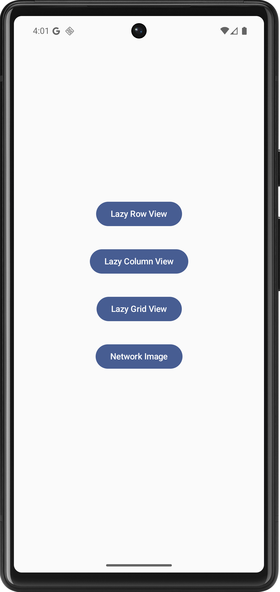
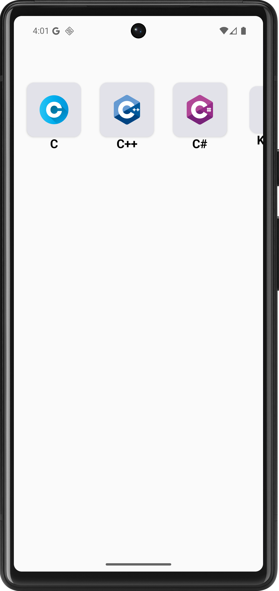
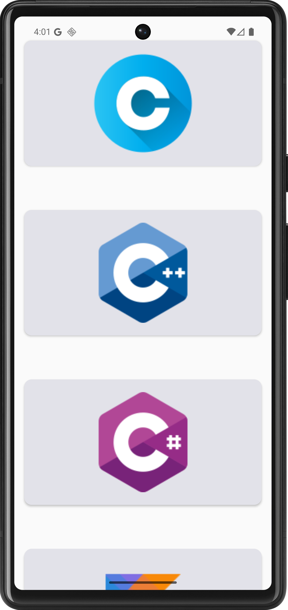
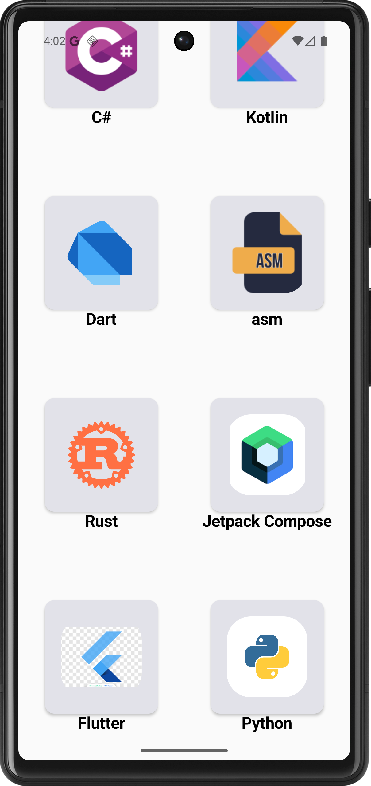

# 📱 Jetpack Compose UI Navigation Showcase

A modern, clean Android app demonstrating powerful **Jetpack Compose UI components** with smooth **Navigation** between multiple screens. Perfect for learning or showcasing Compose capabilities like `LazyRow`, `LazyColumn`, `LazyVerticalGrid`, and screen-based navigation.

---

## 🚀 Features

- 🏠 **Home Screen** — Acts as the main hub
- ➡️ Seamless **Jetpack Compose Navigation**
- 📜 **LazyColumn** — Vertical scrolling list
- 📶 **LazyRow** — Horizontal scrolling row
- 🧱 **LazyVerticalGrid** — Responsive grid layout
- 🎨 **Material 3 Theming**
- ⚡ Smooth performance and modular screen design

---

## 📸 Screenshots

| Home Screen | Lazy Row |
|-------------|----------|
|  |  |

| Lazy Column | Lazy Grid |
|-------------|-----------|
|  |  |

---

## 🧭 Navigation Structure

- `HomeScreen.kt` → Buttons to navigate to each UI component screen
- Uses `NavController` & `NavHost` from `androidx.navigation.compose`
- Follows a **clean route-based navigation pattern**

```kotlin
NavHost(navController, startDestination = "home") {
    composable("home") { HomeScreen(navController) }
    composable("lazy_row") { LazyRowScreen() }
    composable("lazy_column") { LazyColumnScreen() }
    composable("lazy_grid") { LazyGridScreen() }
}
```

---

## 🛠️ Tech Stack

- ✅ Kotlin
- ✅ Jetpack Compose
- ✅ Compose Navigation
- ✅ Material 3
- ✅ Android Studio Giraffe/Hedgehog or later

---

## 📦 Installation

1. **Clone the repository:**

```bash
git clone https://github.com/your-username/jetpack-compose-ui-showcase.git
cd jetpack-compose-ui-showcase
```

2. **Open in Android Studio**
3. **Run the app** on emulator or real device 📱

---

## 🧑‍💻 Folder Structure

```bash
├── ui/
│   ├── HomeScreen.kt
│   ├── LazyRowScreen.kt
│   ├── LazyColumnScreen.kt
│   └── LazyGridScreen.kt
├── navigation/
│   └── NavGraph.kt
└── MainActivity.kt
```

---

## ✨ Author

Made with ❤️ by [Tanvir Ahmed Chowdhury](https://github.com/tanvir-chy-ahmed)

---

## 📄 License

This project is licensed under the MIT License - see the [LICENSE](LICENSE) file for details.
